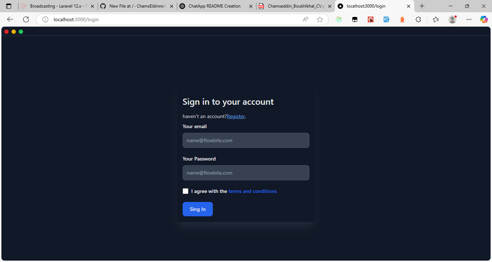
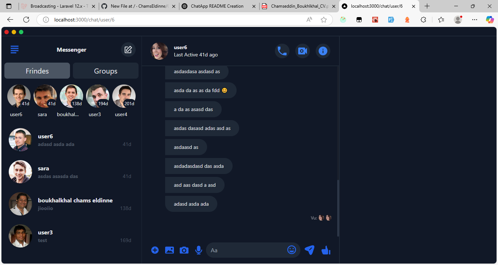
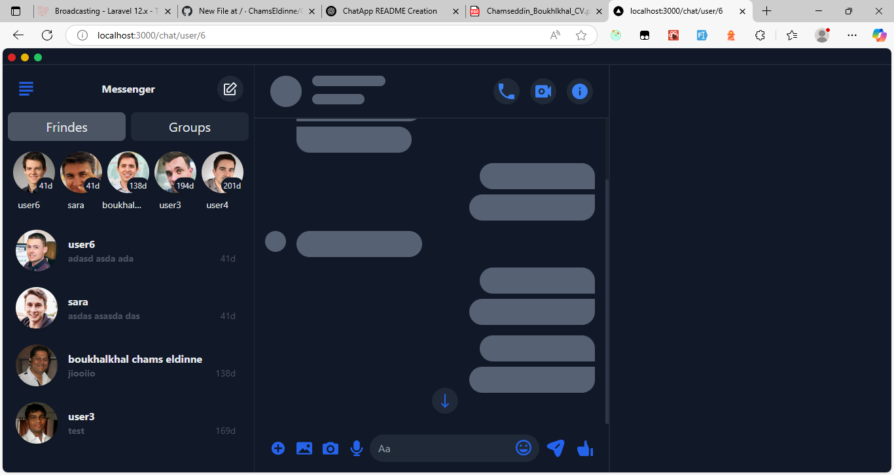

# 💬 ChatApp

A real-time chat platform built with **Laravel** and **Next.js**, enabling seamless communication through private messaging and group chats. Users can connect with friends, join chat groups, and engage in live discussions, while group admins manage membership requests to ensure a secure and organized environment.

## 🚀 Features

- 🔁 **Real-Time Messaging** with WebSockets
- 🧑‍🤝‍🧑 **Friends System** – Add and manage friends
- 👥 **Chat Groups** – Create and join discussion groups
- ✅ **Group Admin Controls** – Accept/reject membership requests
- 🔒 **Structured & Secure Communication**
- ⚡ **Instant Data Sync** across all connected clients

## 🛠️ Tech Stack

- **Backend**: [Laravel](https://laravel.com/)  
- **Frontend**: [Next.js](https://nextjs.org/)  
- **Database**: [SQLite](https://www.sqlite.org/index.html)  
- **Client-side State Management**: [React Query](https://tanstack.com/query/latest)  
- **Real-time Communication**: [WebSockets](https://laravel.com/docs/broadcasting)

## 📦 Installation

### Backend (Laravel API)

```bash
cd backend
composer install
cp .env.example .env
php artisan key:generate
php artisan migrate
php artisan serve
Ensure you have SQLite configured properly in your .env file.
```

### Front-end 
```bash
cd frontend
npm install
npm run dev
```






